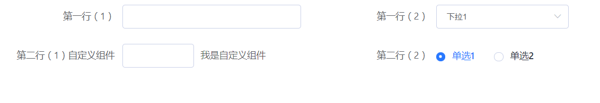
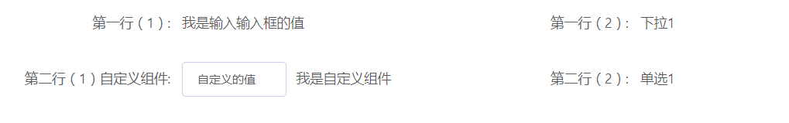

# el-form-maker
基于 element-ui  封装的表单生成器

## 目录
* [介绍](#介绍)
* [特点](#特点)
* [示例](#示例)
* [参数说明](#参数说明)

**概要**
`el-form-maker` 是基于[element-ui](https://github.com/ElemeFE/element)封装的表单生成器,利用render写法封装灵活扩展性极高的组件,jsx的模板渲染解决了render重复嵌套问题,只需简单的配置即可快速生成表单

## 特点
* 只需进行简单的配置，即可原子表单生成
* 支持 _ElFprm_ 的所有的API
* 支持自定义组件渲染及其校验
* 支持表单预览模式
* 支持栅格布局

## 示例

栅格布局模式

```vue 
<template>
  <div class="demo1">
    <el-form-maker :options="options" label-width="180px" />
  </div>
</template>
<script>
const CustomComponent = {
  name: 'custom-componet',
  props: ['value'],
  watch: {
    value: function(val) {
      this.val = val
    }
  },
  data() {
    return {
      val: ''
    }
  },
  render(h) {
    return h('div', {}, [
      h('el-input', {
        style: {
          width: '40%'
        },
        props: {
          value: this.val
        },
        on: {
          input: val => {
            this.$emit('val', val)
          }
        }
      }),
      <span style="marginLeft:10px;">我是自定义组件</span>
    ])
  }
}

export default {
  name: 'demo1',
  data() {
    return {
      options: [
        {
          rowId: 1,
          type: 'input',
          prop: 'a',
          label: '第一行（1）',
          col: {
            span: 8
          }
        },
        {
          rowId: 1,
          type: 'select',
          prop: 'b',
          label: '第一行（2）',
          col: {
            span: 8
          },
          defaultValue: 1,
          options: [
            {
              label: '下拉1',
              value: 1
            },
            {
              label: '下拉2',
              value: 2
            }
          ]
        },
        {
          rowId: 2,
          component: CustomComponent,
          prop: 'c',
          label: '第二行（1）自定义组件',
          col: {
            span: 8
          }
        },
        {
          rowId: 2,
          type: 'radio-group',
          label: '第二行（2）',
          prop: 'd',
          col: {
            span: 8
          },
          defaultValue: '2',
          options: [
            {
              label: '单选1',
              value: '2'
            },
            {
              label: '单选2',
              value: '3'
            }
          ]
        }
      ]
    }
  }
}
</script>

```

预览模式

```vue
  <template>
  <div class="demo1">
    <el-form-maker :options="options" label-width="180px" :isView="true" ref="elFormMaker" label-suffix=": " />
  </div>
</template>
<script>
const CustomComponent = {
  name: 'custom-componet',
  props: ['value'],
  watch: {
    value: function(val) {
      this.val = val
    }
  },
  data() {
    return {
      val: ''
    }
  },
  render(h) {
    return h('div', {}, [
      h('el-input', {
        style: {
          width: '40%'
        },
        props: {
          value: this.val
        },
        on: {
          input: val => {
            this.$emit('val', val)
          }
        }
      }),
      <span style="marginLeft:10px;">我是自定义组件</span>
    ])
  }
}

export default {
  name: 'demo1',
  data() {
    return {
      options: [
        {
          rowId: 1,
          type: 'input',
          prop: 'a',
          label: '第一行（1）',
          col: {
            span: 8
          }
        },
        {
          rowId: 1,
          type: 'select',
          prop: 'b',
          label: '第一行（2）',
          col: {
            span: 8
          },
          defaultValue: 1,
          options: [
            {
              label: '下拉1',
              value: 1
            },
            {
              label: '下拉2',
              value: 2
            }
          ],
          formatter: row => {
            const MAP = {
              1: '下拉1',
              2: '下拉2'
            }
            return MAP[row.b]
          }
        },
        {
          rowId: 2,
          component: CustomComponent,
          prop: 'c',
          label: '第二行（1）自定义组件',
          col: {
            span: 8
          },
          formatter: row => <span>{row.c}</span>
        },
        {
          rowId: 2,
          type: 'radio-group',
          label: '第二行（2）',
          prop: 'd',
          col: {
            span: 8
          },
          defaultValue: '1',
          options: [
            {
              label: '单选1',
              value: '1'
            },
            {
              label: '单选2',
              value: '2'
            }
          ],
          formatter: row => {
            const MAP = {
              1: '单选1',
              2: '单选2'
            }
            return MAP[row.d]
          }
        }
      ]
    }
  },
  async mounted() {
    await this.$nextTick()
    const {updateForm} = this.$refs.elFormMaker
    updateForm({
      a: '我是输入输入框的值',
      b: 1,
      c: '自定义的值',
      d: '1'
    })
  }
}
</script>
```


